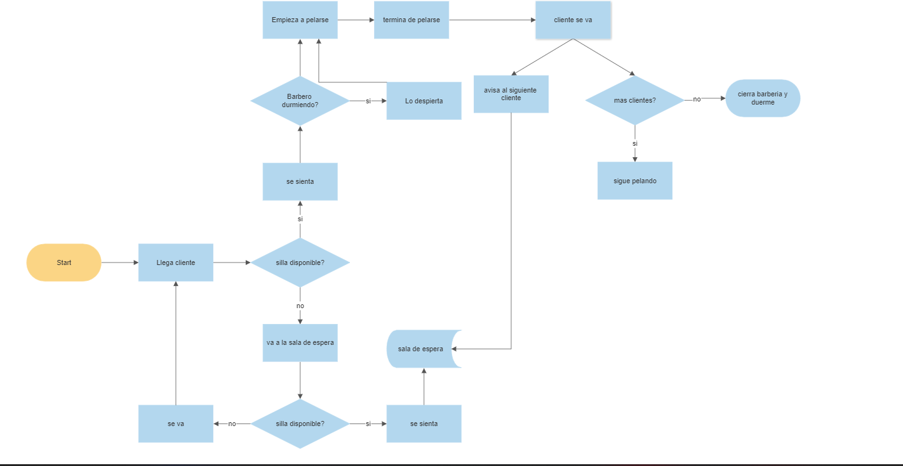

# William de los Santos
## 2021 1368

## Documentacion

Este es el problema del barbero dormilon que basicamente trata sobre una barberia que cuenta con 3 barberos
que estan durmiendo, cuando llega un cliente si hay sillas disponibles despierta un barbero y este lo pela
luego si llega otro cliente y da el caso que no hay sillas disponibles se va a la sala de espera y si no hay tampoco
sillas disponibles en la sala de espera pues este se va.

Cuando un cliente termina de pelarse, avisa (si hay) al otro cliente en sala de espera , el barbero si hay otro cliente sigue trabajando
y cuando no hay mas clientes el barbero se duerme hasta que llegue otro o dado caso que termine la tanda de clientes, cierra la tienda.

## diagrama de flujo 

